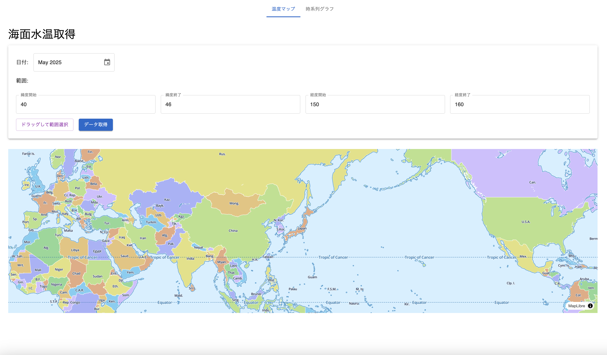

# GIS を用いた海面水温データの可視化アプリ

## 概要
緯度経度ごとに取得された海面水温データを、GIS を用いて分かりやすく可視化するWebアプリ

### 背景
元々大学時代に研究で海洋データを扱っていましたが、研究結果をまとめる際に、データの取得・加工・可視化に多くの時間がかかっていました。そこで、必要な情報を入力するだけで、誰でも直感的にデータの取得から可視化まで行えるツールがあれば便利だと考え、今回形にしてみました。

### 使用データ
本アプリでは NOAA（National Oceanic and Atmospheric Administration）が提供する海洋環境データAPIである [ERDDAP](https://coastwatch.pfeg.noaa.gov/erddap) を使用。

ERDDAP は教育や研究目的で幅広く使用されており、データはオープンソースとなっています。

今回はその中で、海水温の月平均データ [NOAA_DHW_monthly](https://coastwatch.pfeg.noaa.gov/erddap/info/NOAA_DHW_monthly/index.html) を使用しました。

## 技術構成

### フロントエンド（`gui` ディレクトリ）
- TypeScript
- React（UI構築）
- Material-UI（UIコンポーネントライブラリ）
- Vite
- MapLibre GL JS（地図描画）
- React Testing Library（UIテスト）
- Jest（ユニットテスト）
- ESLint（リンター）
- Prettier（コードフォーマッタ）

### バックエンド（`api` ディレクトリ）

- Node.js + Express
  - API 側はシンプルな CRUD 操作のみの実装のため、軽量な Express を選定
- TypeScript
- Jest（ユニットテスト）
- ESLint（リンター）
- Prettier（コードフォーマッタ）
---

## 機能一覧

### 海面水温マップ表示
デフォルト画面


日付、緯度経度の範囲を指定

緯度経度はフォーム入力と、地図上をドラッグして選択可能

フォーム入力


地図上のドラッグ選択


取得ボタン押下後、指定範囲に対応する海水温データを地図上に表示 

表示範囲内の平均・最大・最小温度の統計情報を同時に表示


### 海面水温の時系列データ表示
指定した日付範囲と地点を選択。

地点はフォーム入力と、地図用クリック選択に対応。

クリック選択の場合


取得ボタン押下後、指定地点の月別海水温データを折れ線グラフで表示


---

## 起動方法

npm worktree を使用しているため、プロジェクトルートで以下のコマンドを実行することで起動が可能です。

```bash
npm install
npm run dev
```
また、個別で立ち上げたい場合は以下のように実行してください。

### バックエンド（APIサーバー）の起動

```bash
cd api
npm install
npx ts-node server.ts
```
### フロントエンド（GUI）の起動
```bash
cd gui
npm install
npm run dev
```
